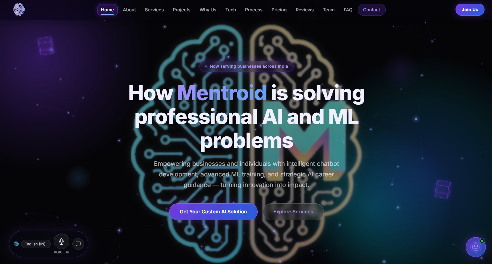

# Mentroid: Empowering Businesses with Intelligent AI Solutions
🌐 **Official Website:** [https://www.mentroid.co.in](https://www.mentroid.co.in)

Mentroid is an AI & Machine Learning service provider turning innovation into impact across India through chatbot development, ML solutions, workflow automation, and strategic consulting. 

This repository serves as the digital storefront and live capability showcase for Mentroid's overarching services. The application features a hands-free Voice Assistant, an interactive Chatbot using a local knowledge base, and dynamic 3D CSS animations to create a highly engaging, modern user experience. Its target audience includes businesses, startups, and individuals seeking scalable AI solutions, ML model training, or technology consulting.

## 💡 What We Do & Our Core Services

We build RAG & LLM-based chatbots, develop custom ML models, create AI automation tools, enhance and develop modern websites, deliver data analytics & predictive solutions, and provide technical guidance.

### 🤖 1. RAG & LLM-Based Chatbots
* Document Q&A Systems
* Knowledge Base Assistants
* Multi-Agent AI Systems
* PDF and Website Chatbots

### 🧠 2. Machine Learning Solutions
* Predictive Analytics
* Recommendation Systems
* Computer Vision
* NLP Applications
* Deep Learning Models

### ⚡ 3. AI Automation Tools
* Workflow Automation
* AI Agents
* Report Generation
* CRM Automation
* Business Process Optimization

### 🌐 4. Website Development & Enhancement
* Full-Stack Web Applications
* API Development
* Dashboard Systems
* AI Integration

## ✨ Major Features
* **Interactive Voice Assistant**: A fully integrated speech-to-text and text-to-speech assistant (`voice-assistant.js`) allowing hands-free site navigation, content reading, and contact form dictation.
* **Local Knowledge Base Chatbot**: A custom UI chatbot (`chatbot.js`) that answers common questions regarding pricing, services, and company information using keyword matching algorithms.
* **Dynamic 3D UI & Parallax**: Features high-performance CSS 3D cubes, particle orbs, and parallax scrolling backgrounds for a premium user experience without heavy WebGL libraries.
* **Automated Contact & Lead Capture**: A customizable contact form (`contact-form.js`) directly integrated with EmailJS or Web3Forms to capture client inquiries seamlessly.
* **Responsive Mobile Drawer & Navigation**: A fully adaptive navigation system with a mobile drawer and smooth scrolling across various sections.

## 🛠️ Technology Stack

### 💻 Repository Stack (Local Build)
This specific repository is a pure static frontend designed to run seamlessly in any browser without complex build steps:
* **Frontend**: HTML5, CSS3 (Vanilla, Custom Properties, 3D Transforms), JavaScript (ES6+ Vanilla)
* **Backend/Database**: None (Pure Static Web Application)
* **DevOps/Tools**: Any Static Hosting Provider (e.g., Vercel, Netlify, GitHub Pages), Web Speech API for voice interactions, EmailJS / Web3Forms APIs for form submissions.

### 🏢 Mentroid Client Services Stack
For production client projects, Mentroid deploys a broader, scalable enterprise stack:
* **AI & Machine Learning**: TensorFlow, PyTorch, OpenAI, Scikit-learn
* **Frontend**: React.js, Tailwind CSS
* **Backend**: Flask, Node.js, Express
* **Database**: MongoDB, Firebase, MySQL
* **Cloud Infrastructure**: AWS, Vercel, Netlify

## 📁 Project Structure
```text
Mentroid/
├── README.md               # Project documentation and setup guide
├── index.html              # Main entry point and structural layout of the landing page
├── style.css               # Core stylesheet including 3D animations, UI components, and responsive design
├── script.js               # General site interactions, mobile menu, and UI event listeners
├── chatbot.js              # Chatbot engine, knowledge base dictionary, and chat UI logic
├── voice-assistant.js      # SpeechRecognition and SpeechSynthesis logic for hands-free navigation
├── contact-form.js         # Form validation and API payload submission logic
├── emailjs-config.js       # Configuration variables for EmailJS and Web3Forms integrations
├── projects-slider.js      # Interactive slider component for the projects showcase section
├── assets/                 # Static media files (images, webm videos, logos)
└── services/               # Detailed HTML pages for specific service offerings
```

## 🔄 Data & Architectural Workflow
1. **User Interaction**: A user visits `index.html` and interacts with either the standard UI, the Voice Assistant microphone, or the floating Chatbot button.
2. **Voice/Chat Processing**:
   - **If using Voice**: The Web Speech API captures audio, transcribes it, and `voice-assistant.js` parses the intent (e.g., "scroll down", "contact form").
   - **If using Chatbot**: `chatbot.js` intercepts text input, compares keywords against the local `KB` dictionary, and renders the reply.
3. **Form Submission**: A user fills the contact form (manually or via voice dictation). `contact-form.js` captures the data, validates it, and reads keys from `emailjs-config.js`.
4. **External API Call**: The contact payload is transmitted via a REST API to EmailJS or Web3Forms.
5. **Confirmation**: The user receives visual feedback on the UI and a confirmation email triggered by the external email service.

## 🚀 Local Setup & Installation
1. **Clone the Repository**
   ```bash
   git clone https://github.com/omroy07/Mentroid-.git
   cd Mentroid
   ```
2. **Protect Your API Keys (Crucial)**
   Before adding your personal testing keys, run the following command. This tells git to ignore your local credential changes so you don't accidentally commit your private keys to GitHub:
   ```bash
   git update-index --assume-unchanged emailjs-config.js
   ```
   *(If you ever need to track changes to this file again, run `git update-index --no-assume-unchanged emailjs-config.js`)*.
3. **Serve Locally**
   Since this is a static HTML/JS site, you don't need a complex build step. You can use any static server.
   *Using Python:*
   ```bash
   python3 -m http.server 8000
   ```
   *Using Node.js (http-server):*
   ```bash
   npx http-server -p 8000
   ```
4. **Access the Application**
   Open your browser and navigate to `http://localhost:8000`.

## 🔑 Environment Variables
This project does not use a traditional `.env` file because it runs entirely in the browser. Instead, all configuration keys are injected via `emailjs-config.js`.

```javascript
// emailjs-config.js
window.MENTROID_CONTACT = {
  toEmail: 'your_contact_email_here',

  // Option B: Web3Forms
  web3formsAccessKey: 'your_web3forms_key_here',

  // Option A: EmailJS (Recommended)
  emailjs: {
    publicKey:             'your_emailjs_public_key_here',
    serviceId:             'your_emailjs_service_id_here',
    adminTemplateId:       'your_emailjs_admin_template_here',
    confirmationTemplateId:'your_emailjs_confirmation_template_here',
  },
};
```

| Object Key | Type | Description |
| :--- | :--- | :--- |
| `toEmail` | String | The target business email destination for lead routing. |
| `web3formsAccessKey` | String | API token provided by the Web3Forms dashboard (Option B). |
| `emailjs.publicKey` | String | Public API key fetched from the EmailJS Account settings (Option A). |
| `emailjs.serviceId` | String | Connected email carrier ID (e.g., service_xxxx) inside EmailJS. |
| `emailjs.adminTemplateId`| String | Template ID used to route complete client briefs to management. |
| `emailjs.confirmationTemplateId`| String | Template ID for sending automated "thank you" replies back to users. |

## 📸 Visuals


## 🤝 Contribution Instructions
1. **Fork & Clone**: Create your own fork of the repository and clone it locally.
2. **Create a Branch**: Create a feature branch off `main` (`git checkout -b feature/your-feature-name`).
3. **Code Style**: This project uses Vanilla JavaScript and CSS. Ensure that you maintain the existing architectural style (e.g., isolating feature logic into separate `.js` files and utilizing CSS variables for theme consistency).
4. **Test Voice & Chat**: If your changes impact the UI, test the `voice-assistant.js` commands and the `chatbot.js` keyword triggers to ensure they don't break functionality.
5. **Submit a PR**: Push your changes and open a Pull Request with a clear description of the problem solved or the feature added.

---
<div align="center">
  <b>🌐 <a href="https://www.mentroid.co.in">Visit the Official Mentroid Website</a></b>
</div>
